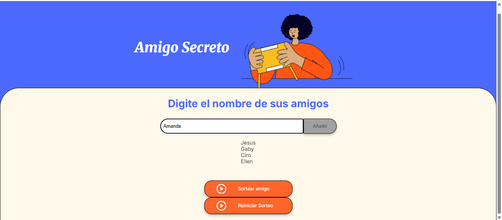
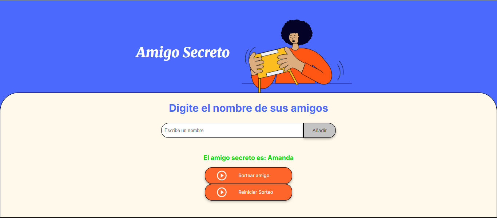
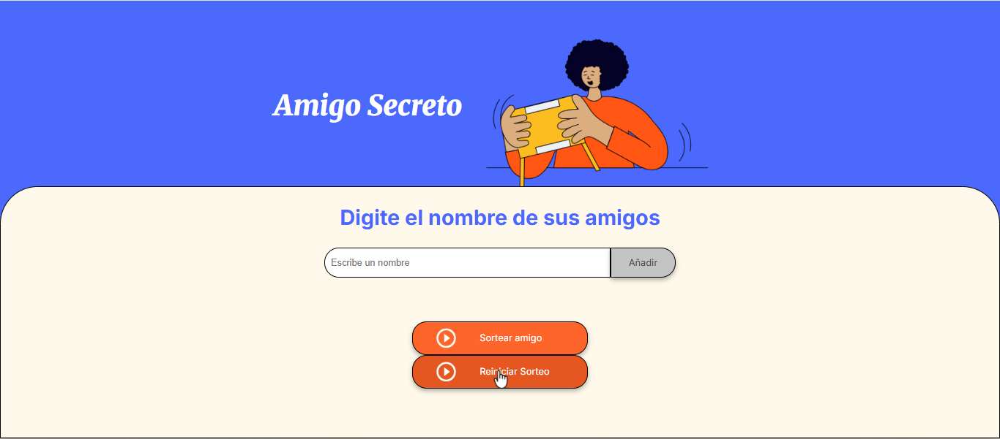

# 🎁 Challenge Amigo Secreto

Este proyecto forma parte de la **formación de Principiante en Programación** del programa **ONE (Oracle Next Education) impulsado por Oracle y Alura Latam**.  
El objetivo principal fue practicar y aplicar **lógica de programación con JavaScript**, utilizando una estructura de **HTML y CSS** ya proporcionada como base (con opción de editar).

---

## 🚀 Funcionalidades desarrolladas

- ✅ **Agregar nombres**: Permite ingresar los nombres de los participantes.  
- ✅ **Validar entrada**: El sistema evita:
  - Nombres vacíos.  
  - Números.  
  - Caracteres especiales.  
- ✅ **Visualizar la lista**: Muestra en pantalla todos los nombres ingresados.  
- ✅ **Limpiar campo de texto**: Después de agregar un nombre, el campo de entrada se limpia automáticamente para escribir el siguiente.  
- ✅ **Sorteo aleatorio**: Selecciona al azar un nombre de la lista de participantes.  
- ✅ **Reiniciar sorteo**:  
   - Se agregó una línea al **HTML** para crear el nuevo botón.  
   - Se copió el mismo estilo del botón "Sortear Amigo" en el **CSS** para mantener la coherencia visual.  

---

## 🖼️ Capturas de Pantalla

### ➕ Agregar nombres


### 🎲 Realizar el sorteo


### 🔄 Reiniciar sorteo


---

## 🛠️ Tecnologías utilizadas

- **HTML5** (estructura base + una línea extra para el botón *Reiniciar*)  
- **CSS3** (estilos base + copia del estilo del botón "Sortear Amigo")  
- **JavaScript** (toda la lógica del challenge desarrollada aquí)  

---

## 📂 Cómo usar este proyecto

1. Clona el repositorio:  
   ```bash
   git clone https://github.com/tu-usuario/challenge-amigo-secreto.git
2. Abre el archivo index.html en tu navegador.
3. Agrega los nombres, realiza el sorteo y, si lo deseas, usa el botón Reiniciar sorteo 🎉
